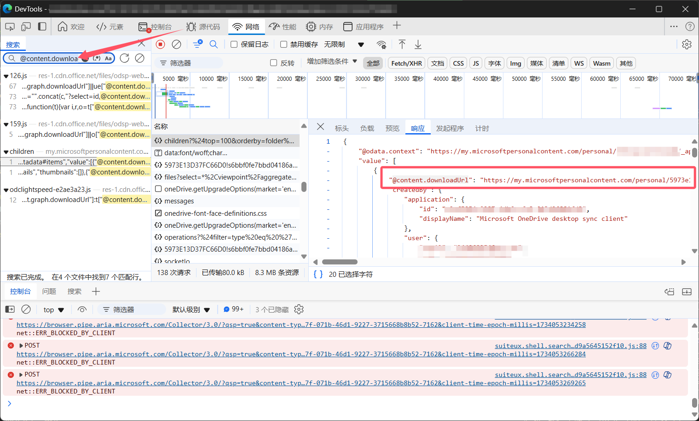

# OneDriveShareLinkPushAria2

Extract download URLs from OneDrive or SharePoint share links and push them to aria2, even on systems without a GUI.

从 OneDrive 或 SharePoint 共享链接提取下载 URL 并将其推送到 aria2，即使在无图形界面的系统中依然可以使用。

# 依赖

requests==2.25.1

pyppeteer==0.2.5

# 特点

目前本程序支持的下载方式：

- xxx-my.sharepoint.com 下载链接的下载
  - 无下载密码的多文件推送
  - 有下载密码的多文件推送
  - 嵌套文件夹的文件推送
  - 任意选择文件推送
  - 针对超多文件（超过 30 个）的分享链接，实现了的遍历查看和下载
- xxx.sharepoint.com 下载链接的下载
- xxx-my.sharepoint.cn 下载链接的下载(理论上支持)

**注意：Aria2 本身不支持 HTTP POST 型的下载链接，而 OneDrive 文件夹打包下载为 HTTP POST 型的下载链接，所以本程序将不会支持 OneDrive 文件夹打包下载**

## 输出文件列表

使用以下命令输出文件列表到 list.txt

```bash
python main.py > list.txt
```

使用 powershell 运行此命令可能会输出乱码, 先运行以下命令即可修复

```bash
[System.Console]::OutputEncoding = [System.Text.Encoding]::UTF8
```

## OneDrive 个人版

截至 2024 年 12 月 13 日，OneDrive 个人版的下载链接为直链，可以打开 F12 后刷新页面，找到 Network(网络)中的`https://my.microsoftpersonalcontent.com/_api/v2.0/drives/{}/items/{}children?%24top=100&orderby=folder%2Cname&%24expand=thumbnails%2Ctags&select=*%2Cocr%2CwebDavUrl%2CsharepointIds%2CisRestricted%2CcommentSettings%2CspecialFolder%2CcontainingDrivePolicyScenarioViewpoint&ump=1`请求 (花括号中的内容会随着不同的文件而改变)，查看返回的 json 数据，找到`@content.downloadUrl`字段，即为下载链接。

或者转到Network中，按下Ctrl + F，输入`@content.downloadUrl`，找到对应的请求，查看返回的数据，找到`@content.downloadUrl`字段，即为下载链接。



可以查看[test.py](../test.py)文件，里面有一个示例，可以直接运行，获取对应的json数据。

## 无密码的链接

以 https://gitaccuacnz2-my.sharepoint.com/:f:/g/personal/mail_finderacg_com/EheQwACFhe9JuGUn4hlg9esBsKyk5jp9-Iz69kqzLLF5Xw?e=FG7SHh 这个下载链接为例

此时需要使用无密码的下载代码，也就是[main.py](../main.py)，打开这个文件，可以看到有一些全局变量：

- OneDriveShareURL: 下载地址，此处应该填写 https://gitaccuacnz2-my.sharepoint.com/:f:/g/personal/mail_finderacg_com/EheQwACFhe9JuGUn4hlg9esBsKyk5jp9-Iz69kqzLLF5Xw?e=FG7SHh
- aria2Link: aria2 的 rpc 地址，如果是本机，一般是 `http://localhost:端口号/jsonrpc`
- aria2Secret: aria2 的密码
- isDownload: 是否下载，如果是`False`，只输出文件列表
- downloadNum: 要下载的文件列表，**0**表示全部下载

如果想要下载第二个文件，则需要`downloadNum="2"`

如果想要下载第二、第三个文件，则需要`downloadNum="2-3"`

如果想要下载第二、第三、第四、第七个文件，则需要`downloadNum="2-4,7"`

以此类推

修改好后，确保目标 aria2 处于开启状态，执行`python3 main.py`

## 有密码的链接

以 https://jia666-my.sharepoint.com/:f:/g/personal/1025_xkx_me/EsqNMFlDoyZKt-RGcsI1F2EB6AiQMBIpQM4Ka247KkyOQw?e=oC1y7r 这个下载链接为例

此时需要使用有密码的下载代码，也就是[havepassword.py](../havepassword.py)，打开这个文件，可以看到有一些全局变量（重复的不再赘述）：

- OneDriveSharePwd: OneDrive 链接的密码

使用方法和上面类似。

# 注意

使用前，使用 `git clone https://github.com/gaowanliang/OneDriveShareLinkPushAria2.git` 将项目整个克隆，才能使用，havepassword.py 依赖于 main.py，如果要使用需要密码的版本，需要 `pip install pyppeteer`

此程序基本功能都已实现，之后很长的一段时间内，如果不是软件无法使用了，则不再维护，如有运行问题，请在提出 issue 时带上下载链接，不提供下载链接的 bug 类型的 issue 将不会解决。
